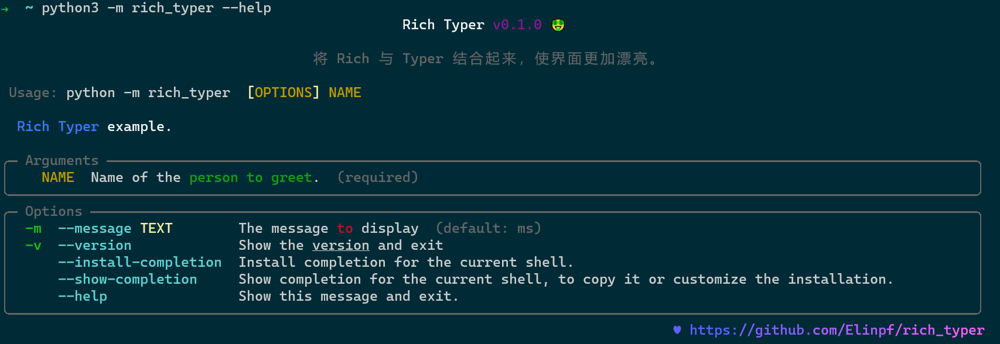

# Rich Typer

## 介绍

本项目是将Rich和Typer结合在一起，将CLI打造的更加美观漂亮。



## 安装

```bash
pip install rich_typer
```

或者使用`poetry` 安装

```bash
git clone https://github.com/Elinpf/rich_typer
cd rich_typer
poetry build
pip install dist/<whl_file>
```

## 使用

完全兼容[Typer](https://github.com/tiangolo/typer)语法，具体语法细节参考[Typer官方文档](https://typer.tiangolo.com/)


除此之外增加了如下几个参数：

- `banner`  增加标题
- `banner_justify` 标题位置
- `epilog_blend` 底部信息的渐变色
- `usage` 自定义Usage

## Example

```py
from rich_typer import RichTyper, Argument, Option


app = RichTyper()
banner = f"[b]Rich Typer[/b] [magenta][/] 🤑\n\n[dim]将 Rich 与 Typer 结合起来，使界面更加漂亮。\n"

url = "♥ https://github.com/Elinpf/rich_typer"


@app.command(banner=banner, banner_justify='center', epilog=url)
def main(
    name: str = Argument(...,
                         help="Name of the [green]person to greet[/]."),
    message: str = Option('ms', '-m', '--message',
                                help="The message [red]to[/] display"),
    version: bool = Option(False, '-v', '--version',
                           help="Show the [u]version[/] and exit"),
) -> None:
    """[bold][blue]Rich Typer[/] example."""
    ...


app()
```
